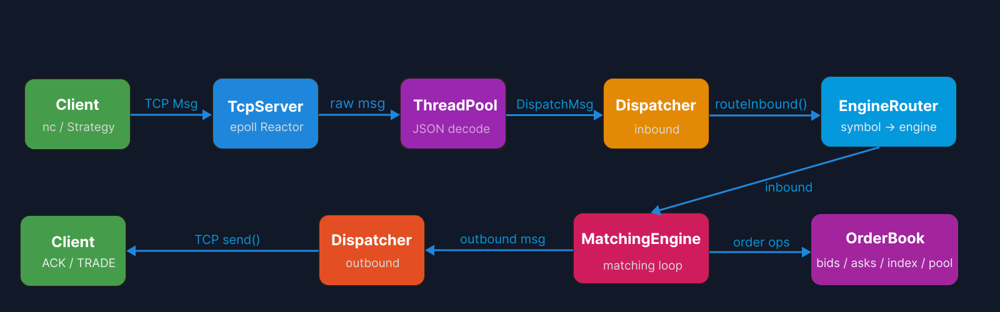
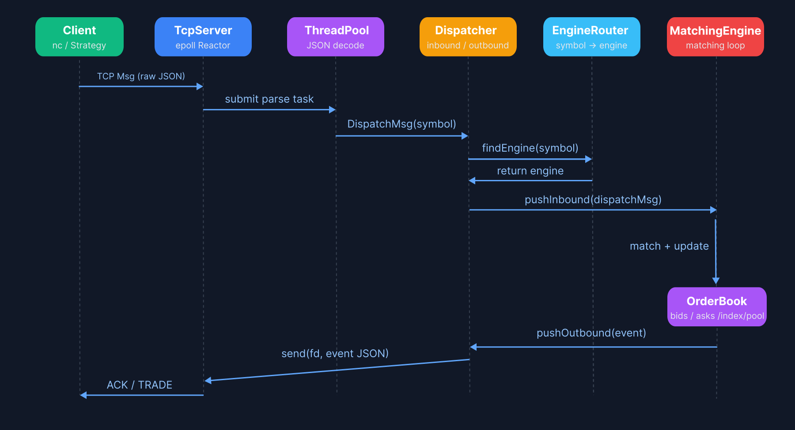
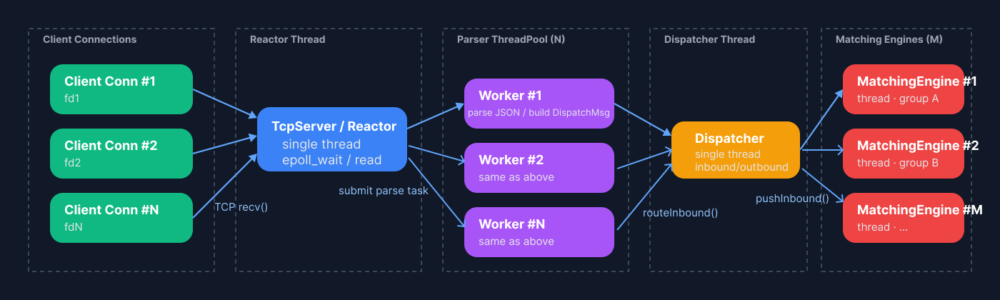

<p align="right">
  <a href="README.md">中文</a> | <a href="README_EN.md">English</a>
</p>

# MatchingEngine — High-Performance C++17 Matching Engine Prototype


This project implements a high-performance matching engine prototype based on a **Reactor + Dispatcher + MatchingEngine + OrderBook** architecture. It includes a complete order-processing pipeline and deterministic matching logic.

Key system components include:

- **TCP Network Ingress (epoll-based Reactor)**: event-driven, non-blocking I/O  
- **Multi-threaded message parsing (ThreadPool)**: parse JSON & build `DispatchMsg`  
- **Symbol routing (EngineRouter)**: multi-symbol mapping; one MatchingEngine can manage multiple symbols  
- **OrderBook**: bid/ask price levels, FIFO queues, O(1) orderId lookup via hash table; supports partial/complete fill & cancel  
- **MatchingEngine**: single-threaded deterministic matching that generates `TradeEvent`, ensuring strict execution order  
- **End-to-end flow**: client order → TcpServer → Dispatcher → MatchingEngine → trade reports → client  

This project is suitable for:

- Quant developer / trading system interview preparation  
- High-performance C++ engineering demonstrations  
- Learning matching engine data structures and system architecture  

## 📁 Project Structure

```
OrderBook/
├── include/               # Public headers
│   ├── core/              # OrderBook, price levels, object pool
│   ├── dispatch/          # Dispatcher
│   ├── engine/            # MatchingEngine, EngineRouter
│   ├── net/               # EpollReactor, TcpServer, TcpConnection
│   └── utils/             # Logger, ThreadPool, LockFreeQueue, Parser
├── src/                   # Core implementation
├── tests/                 # Unit tests
├── third_party/           # Third-party libraries (e.g., googletest)
└── CMakeLists.txt         # Build script
```

## 🧩 System Architecture




## 🔄 消息流



## 🧵 线程模型


## 🚀 Core Features

### Network Layer (Reactor Model)
- High-performance, event-driven network model based on epoll  
- TcpServer with non-blocking I/O  
- Built-in thread pool for JSON message parsing  

### Order Dispatch Layer (Dispatcher + EngineRouter)
- Dispatcher handles inbound → engine routing and outbound → client delivery  
- EngineRouter manages symbol mapping: one MatchingEngine can handle multiple symbols  
- Captures engine outbound events and asynchronously writes responses back to clients  

### Matching Engine (MatchingEngine)
- Single-threaded deterministic matching (no locks, no race conditions)  
- Supports NEW_ORDER, CANCEL_ORDER, TRADE_REPORT  
- Generates `TradeEvent` and submits it to Dispatcher  
- Ensures consistent event ordering  

### OrderBook (Core Component)
- Bid/ask price level structure  
- Maintains bestBid / bestAsk  
- FIFO queue per price level  
- Built-in object pool  
- O(1) orderId lookup via hash table  
- Full matching workflow (partial/full fill, cancel, level cleanup)

## ⚙️ Build & Run

### Build
```bash
mkdir build && cd build
cmake ..
make -j
```

### Start Matching Engine Server
```bash
./src/matchengine_main
```

### Test with netcat
```bash
nc 127.0.0.1 9000
```

## 📥 Example Orders

### New Order
```json
{"type":"NEW_ORDER","symbol":"MAOTAI","side":"BUY","price":100,"qty":10}
```

### Sell Order (match expected)
```json
{"type":"NEW_ORDER","symbol":"MAOTAI","side":"SELL","price":99.0,"qty":5}
```

### Cancel Order
```json
{"type":"CANCEL_ORDER","symbol":"MAOTAI","orderId":1}
```

## 📈 Performance (Future Work)

- Inbound TPS per engine  
- Pure matching latency  
- End-to-end RTT  
- ThreadPool saturation  

## 🧭 Roadmap

- Multi-engine sharded matching  
- Market data broadcasting  
- Persistence (Snapshot + WAL)  
- SO_REUSEPORT multi-reactor scaling  
- WebSocket gateway  
- Full unit test coverage  
- Benchmark module  

## 📄 License

MIT License.  
See the [`LICENSE`](./LICENSE) file for details.
